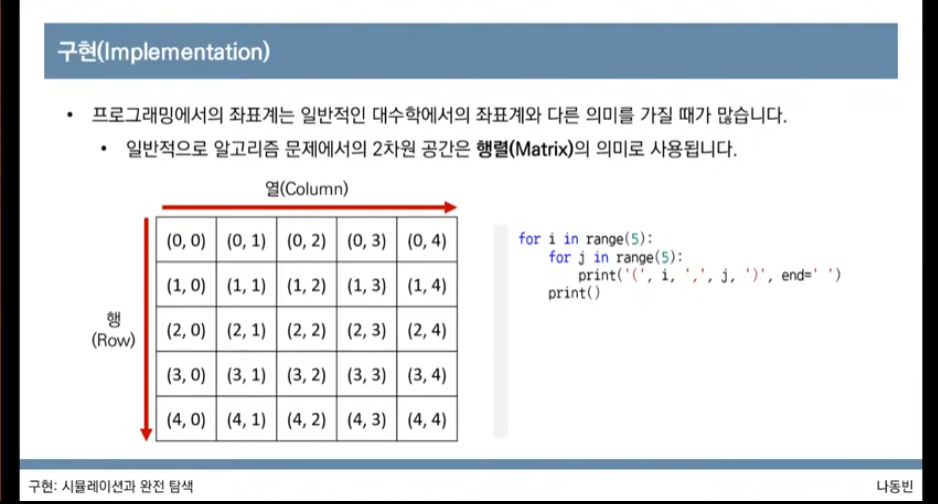
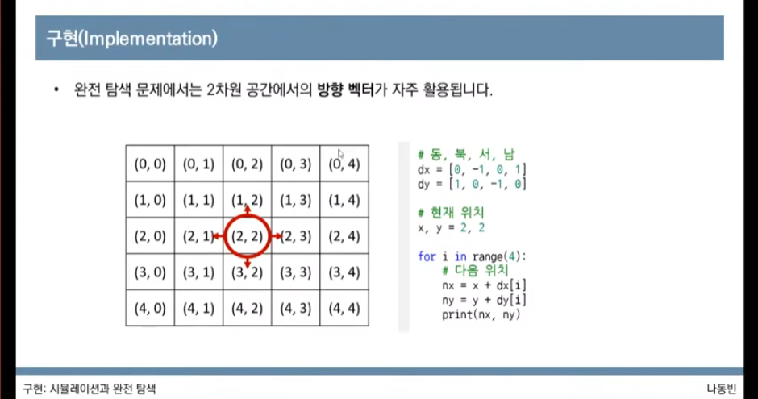

# 구현 유형

## 정의

풀이를 떠올리는 것은 쉽지만 소스코드로 옮기기 어려운 문제를 지칭합니다.

### 예시

-   알고리즘은 간단한데 코드가 지나칠 만큼 길어지는 문제
-   실수 연산을 다루고, 특정 소수점 자리까지 출력해야 하는 문제
-   문자열을 특정한 기준에 따라서 끊어 처리해야 하는 문제
-   적절한 라이브러리를 찾아서 사용해야 하는 문제

## 활용할 수 있는 요소

### 좌표계

### 완전탐색

