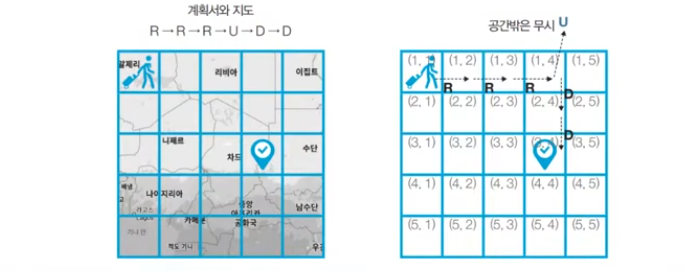

# 상하좌우

## 문제설명

-   여행가 A는 N x N 크기의 정사각형 공간 위에 서 있습니다. 
    이 공간은 1 x 1 크기의 정사각형으로 나누어져 있습니다. 
    가장 왼쪽 위 좌표는 (1,1)이며, 가장 오른쪽 아래 좌표는 (N,N)에 해당합니다. 
    여행가 A는 상, 하, 좌, 우 방향으로 이동할 수 있으며, 시작 좌표는 항상 (1,1) 입니다. 
    우리 앞에는 여행가 A가 이동할 계획이 적힌 계획서가 놓여 있습니다. 
-   계획서에는 하나의 줄에 띄어쓰기를 기준으로 하여 L, R, U, D 중 하나의 문자가 반복적으로 적혀 있습니다. 
    각 문자의 의미는 다음과 같습니다. 

*   L: 왼쪽으로 한 칸 이동
*   R: 오른쪽으로 한 칸 이동
*   U: 위로 한 칸 이동
*   D: 아래로 한 칸 이동

-   이 때 여행가 A가 N x N 크기의 정사각형 공간을 벗어나는 움직임은 무시됩니다. 
    예를 들어 (1, 1)의 위치에서 L 혹은 U를 만나면 무시됩니다. 
    다음은 N = 5인 지도와 계획서입니다. 

## 문제 조건

### 입력조건

-   첫째 줄에 공간의 크기를 나타내는 N이 주어집니다. (1 <= N <= 100)
-   둘째 줄에 여행가 A가 이동할 계획서 내용이 주어집니다. (1 <= 이동 횟수 <= 100)

### 출력조건

-   첫째 줄에 여행가 A가 최종적으로 도착할 지점의 좌표(X, Y)를 공백을 기준으로 구분하여 출력합니다.

### 입력예시

5  
R R R U D D  

### 출력예시

3 4
