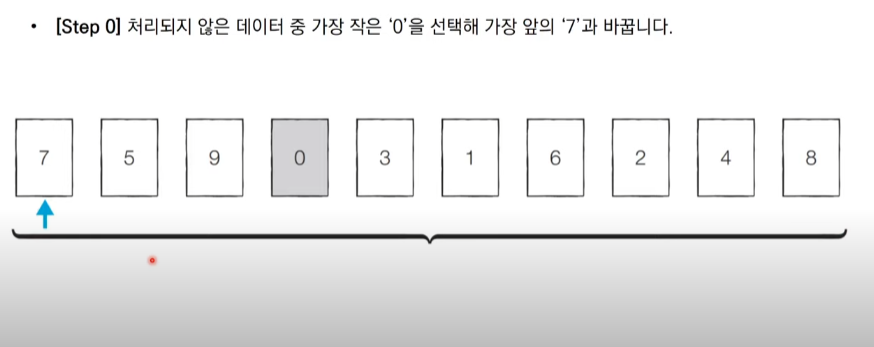
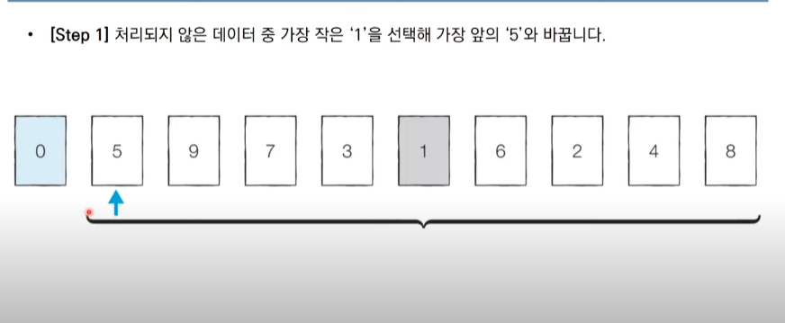
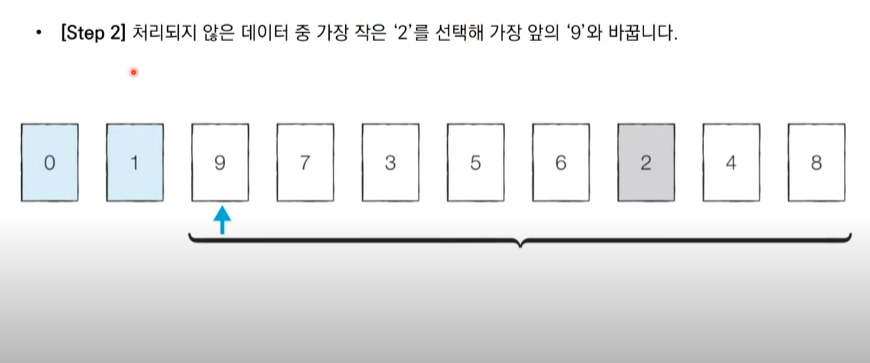
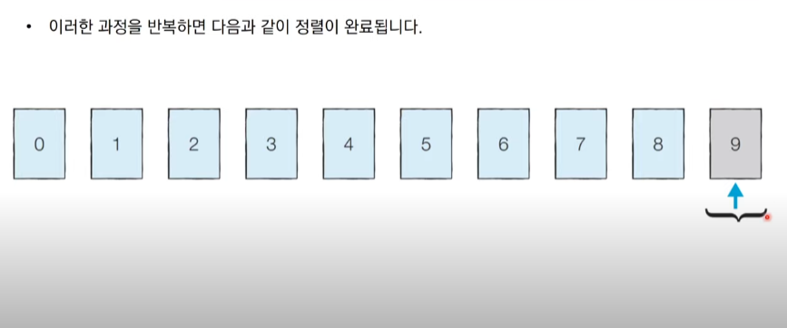

# 선택 정렬

## 정의

처리되지 않은 데이터 중에서 <b>가장 작은 데이터를 <u>선택</u>해 맨 앞에있는 데이터와 바꾸는 것을 반복</b>합니다.<br>

## 선택 정렬 동작 예시





.<br>
.<br>
.<br>

<br>

## 구현

매번 선형탐색을 해야하므로 2중 for문을 사용해서 구현이 가능하다.

## 시간복잡도

-   선택 정렬은 N번 만큼 가장 작은수를 찾아서 맨 앞으로 보내야합니다.
-   구현방식에 따라서 사소한 오차는 있을 수 있지만, 전체 연산 횟수는 다음과 같습니다.

```
    // 등차수열 형식
    N + (N - 1) + (N - 2) + ... + 2
```

-   이는 (N² + N -2) / 2 로 표현할 수 있는데, 빅오 표기법에 따라서 O(N²)이라고 작성합니다.
